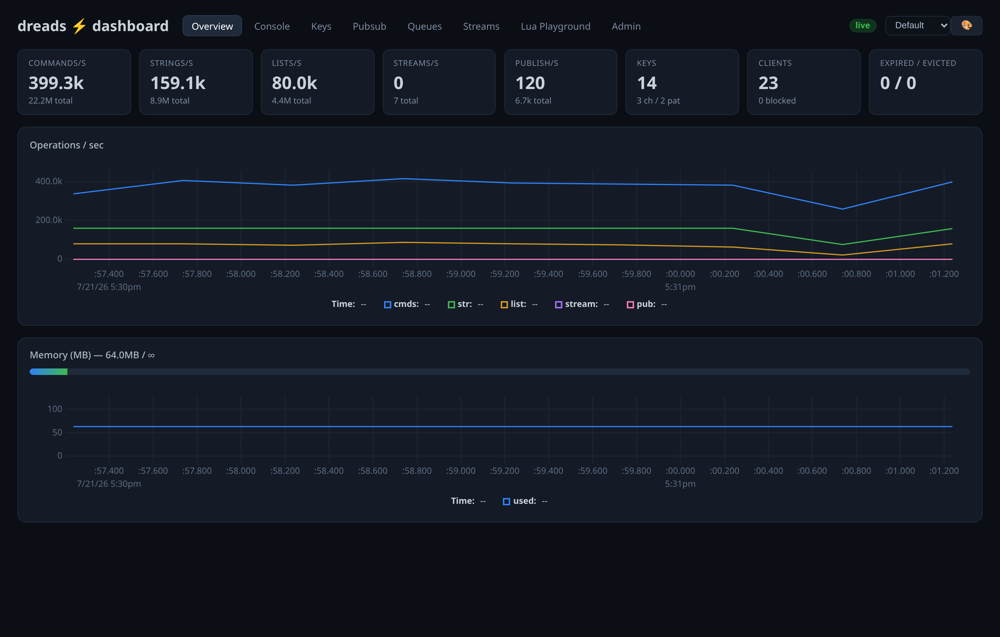
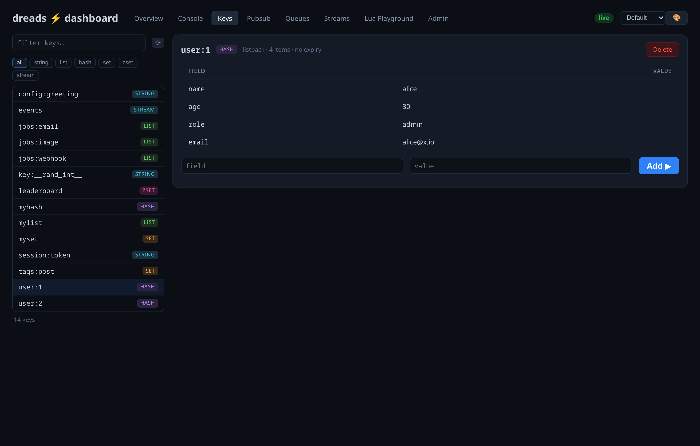
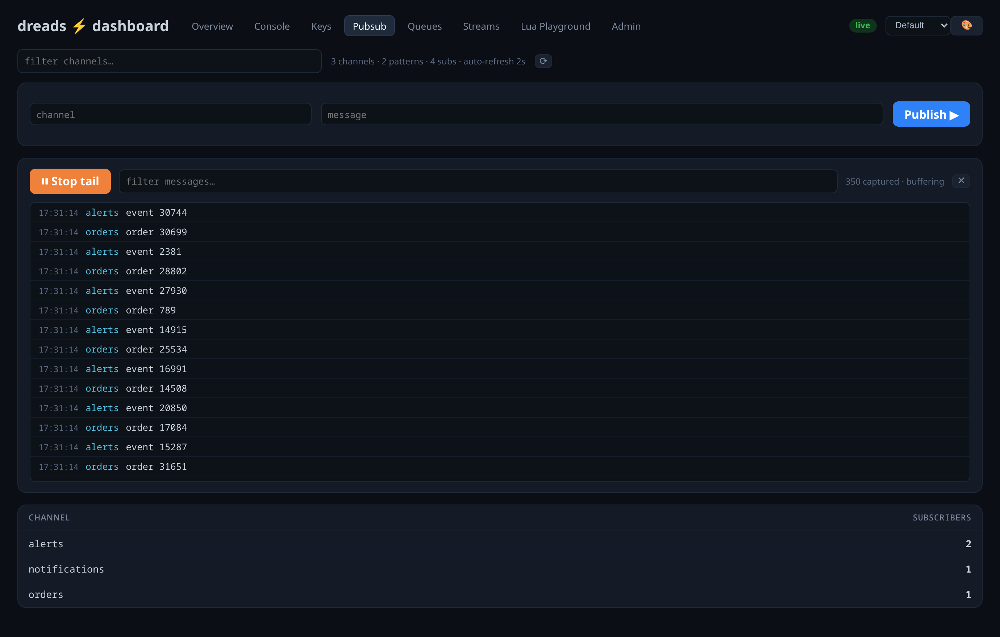
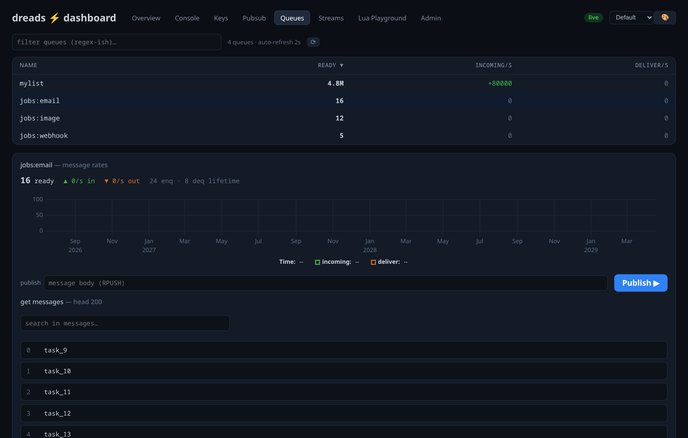
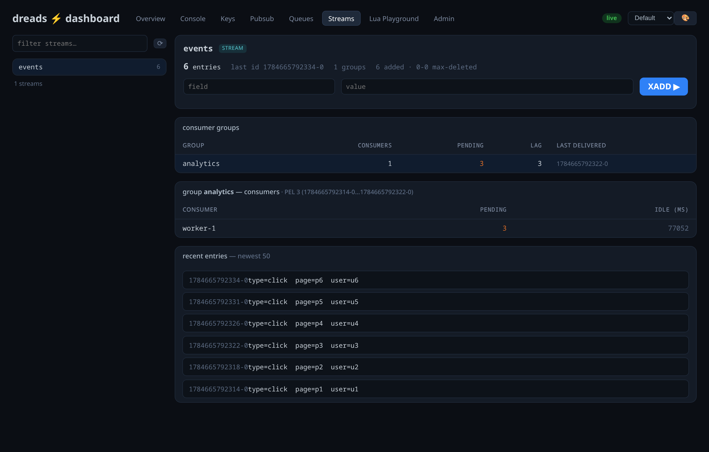
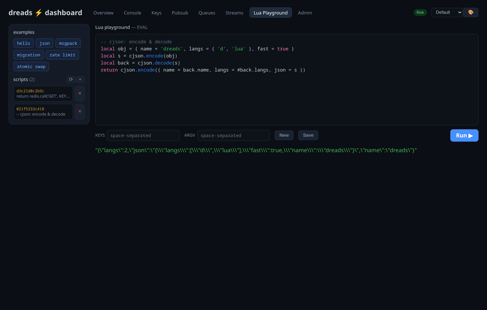
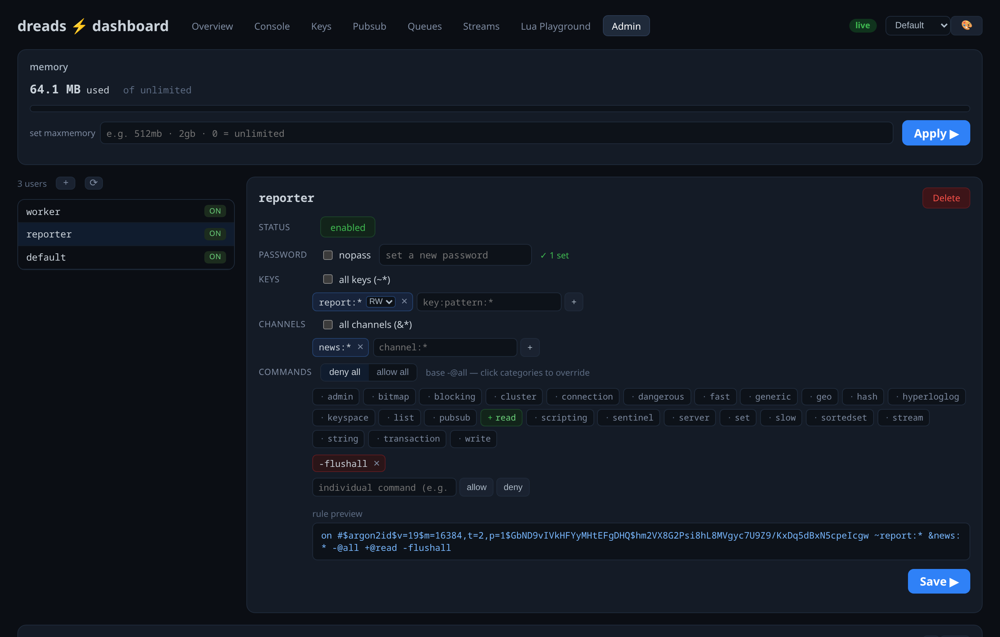

# The built-in dashboard

dreads ships a **web dashboard inside the binary** — no sidecar, no extra process.
It's a developer-debug tool first: *"I ran my test, show me what just happened NOW"* —
live rates, key/stream/queue inspectors, a Lua playground, and ACL admin.

<p align="center">
  
</p>

It runs on its **own thread** with an isolated event loop (never shares fibers with
the data plane), speaks **hand-rolled HTTP + WebSocket** on `listenTCP` (no vibe-d —
its GC use would stop-the-world the data plane, which runs under `GC.disable`), and is
written `@nogc`. **Off by default; when off it costs nothing** — no thread, no port, no
per-command work. You can even [compile it out entirely](#compile-it-out).

## Enable it

Opt in with `dashboard yes`. It defaults to the RESP port **+ 1** and binds
**localhost** — safe by default.

```sh
dreads --port 6379 --dashboard yes            # dashboard on http://127.0.0.1:6380
```

| directive | default | meaning |
|---|---|---|
| `dashboard` | `no` | master switch (opt-in) |
| `dashboard-port` | `0` → RESP+1 | listen port |
| `dashboard-bind` | `127.0.0.1` | bind address — set `0.0.0.0` to expose (then set a password!) |
| `dashboard-password` | *(none)* | login password; also gates the metrics WebSocket |
| `dashboard-write` | `no` | allow writes from the UI (SET/LPUSH/DEL/XADD/EVAL…) |
| `dashboard-admin` | `no` | allow ACL-user + CONFIG admin from the UI |
| `dashboard-interval` | `500` | metrics snapshot cadence (ms) — only ticks while a client watches |

Three privilege tiers, each opt-in: **read** (always), **write** (`dashboard-write`),
**admin** (`dashboard-admin`). A password screen appears whenever `dashboard-password`
is set; the metrics WebSocket is gated too (`?auth=`).

## The tabs

### Overview — live rates, not just totals
Per-second rates by command group (commands, strings, lists, streams, publishes),
client/blocked counts, expired/evicted, and a used/max memory bar — diffed from
`gCmdStats` between snapshots, so it reuses the counters `INFO` already keeps.

### Console
Run any Redis command straight from the browser, with history — `SET`, `LRANGE`,
`INFO`, whatever. Gated by the read/write/admin tiers.

### Keys — inspect any key by type
<p align="center"></p>

Browse with a name filter + type chips; the detail renders per type (string / list /
hash / set / zset / stream) with `OBJECT ENCODING`, size, and TTL. Edit or delete
values inline (write tier).

### Pubsub — channels + a batched live tail
<p align="center"></p>

Active channels with subscriber counts, pattern count, shard channels, and a publish
tester. **Live tail** buffers published messages server-side (`PUBSUB TAP`) and drains
them in batches — you watch traffic flow without any per-message cost on the hot path.

### Queues — Redis lists as RabbitMQ-style queues
<p align="center"></p>

Lists used as job queues (Celery/RQ/Sidekiq), with **real incoming vs deliver rates**
from native `QSTATS` counters (Δenqueued / Δdequeued) — not a net-depth guess — plus a
message-rates chart, a publish box, and a message viewer.

### Streams — entries + consumer groups + PEL
<p align="center"></p>

Per stream: `XINFO STREAM` header, the consumer-groups table (consumers / pending /
lag / last-delivered) → click a group for its consumers (`XINFO CONSUMERS`) and pending
summary (`XPENDING`), plus recent entries and an `XADD` form.

### Lua playground — examples, save-by-SHA, run
<p align="center"></p>

A syntax-highlighted editor that runs `EVAL`, with an **examples** library
(hello / json / msgpack / migration / rate-limit / atomic-swap), a **New** blank script,
**Save** (`SCRIPT LOAD` — cache by SHA without running), and a by-SHA sidebar of cached
scripts you can load or remove.

### Admin — ACL users + memory (admin tier)
<p align="center"></p>

A real **ACL builder** — no hand-writing rule tokens: status toggle, password / nopass,
all-keys + key chips (with R/W/RW), channel chips, a command base (deny-all / allow-all)
+ the ACL category grid as click-to-cycle allow/deny chips + individual commands, with a
live **rule preview**. Create / edit / delete users (`default` protected). Plus a
**memory** panel to bump *or* shrink `maxmemory`, and an **emitted-commands log** — every
admin action becomes a command you can copy and save as a setup script.

## Themes

The whole palette is CSS variables; a theme is a var set. Built-ins: **default**,
**desert**, **solarized**, **mocha**, **dracula**. The 🎨 editor lets you upload a custom
theme (JSON of the vars) — and custom themes are stored **in the dreads keyspace** (hash
`dash:themes`, active in `dash:theme:active`), so they persist server-side across browsers.

## In a container

The dashboard binds localhost by default — unreachable through a Docker port mapping. To
expose it, bind off localhost and set a password:

```sh
docker run -d -p 6379:6379 -p 6380:6380 \
  -e DREADS_DASHBOARD=yes -e DREADS_DASHBOARD_BIND=0.0.0.0 \
  -e DREADS_DASHBOARD_PASSWORD=changeme \
  ghcr.io/caetanus/dreads:latest
```

A full dev stack (persistence + dashboard) is in [`docker-compose.yml`](docker-compose.yml).

## Compile it out

The dashboard is behind `version(DreadsDashboard)` (on by default). Build the
`no-dashboard` configuration to drop it entirely — no module code, no embedded UI,
a smaller binary, and `--dashboard yes` becomes a no-op:

```sh
dub build -b release --config=no-dashboard
```

The built UI bundle (`vendor/dashboard/dist/index.html.gz`) is committed, so **building
dreads never requires Node** — `vendor/dashboard/build.sh` only rebuilds it when the
frontend sources change *and* npm is present, otherwise it uses the committed bundle.
