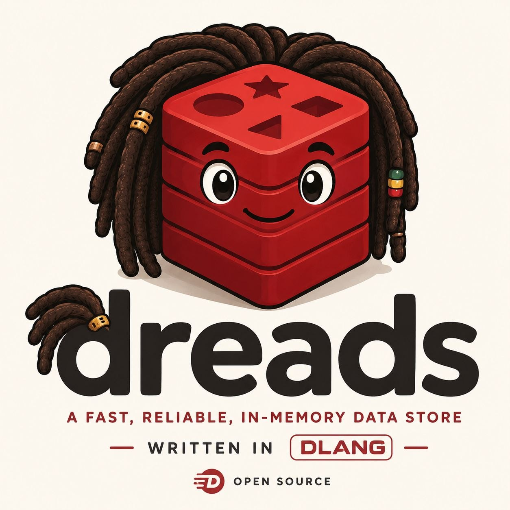

<p align="center">
  
</p>

<h1 align="center">dreads ⚡</h1>

<p align="center"><b>A fast, reliable, in-memory data store — written in D.</b></p>

<p align="center">
  <a href="https://github.com/caetanus/dreads/actions/workflows/ci.yml"></a>
  <a href="https://github.com/caetanus/dreads/actions/workflows/windows.yml"></a>
  <a href="https://github.com/caetanus/dreads/actions/workflows/macos.yml"></a>
  <a href="https://github.com/caetanus/dreads/actions/workflows/docker.yml"></a>
  <a href="https://github.com/caetanus/dreads/pkgs/container/dreads"></a>
  <a href="https://github.com/caetanus/dreads/releases"></a>
</p>

<p align="center"><sub>The CI badge is green only when the full test suite passes — the native Valkey parity sweep (<code>source/tests/valkey_*</code>), the Lua sandbox tests, and every unit test, on each push.</sub></p>

Redis-compatible, built with D/dub, vibe-core fibers, and the `draft` Raft
package. The day-to-day build uses reggae+ninja; the runtime is built around
three commitments: zero GC in the data plane, arena memory, and one purpose —
speed. It speaks RESP2/RESP3 and tracks Redis/Valkey on the supported command
surface. Builds on Linux, macOS (Apple Silicon), and Windows — the Windows build
is standalone (**[no Raft on Windows](WINDOWS.md)**).

```
⟜ Ultra-light. 16 logical DBs on one event-loop thread.
⟜ Arena memory. Zero-GC data plane.
⟜ Raft-replicated log. Custom types. One purpose: Speed.
```

## Try it today

One command, no build — pull and run:

```sh
docker run --rm -p 6379:6379 ghcr.io/caetanus/dreads:latest
```

Then, from another shell, talk to it with any Redis client:

```sh
redis-cli -p 6379 PING           # PONG
redis-cli -p 6379 SET hello world
redis-cli -p 6379 GET hello      # "world"
```

The image is **multi-arch (amd64 + arm64)** — it runs on Apple Silicon and AWS
Graviton. Want the smaller one? Use `ghcr.io/caetanus/dreads:latest-alpine`
(lighter, slightly slower). To keep your data, mount a volume and enable the AOF:

```sh
docker run -d --name dreads -p 6379:6379 -v dreads-data:/data \
  ghcr.io/caetanus/dreads:latest 6379 --appendonly
```

**Swap it in for Redis in dev.** dreads speaks RESP2/RESP3 on port 6379, so your
existing clients and tooling — `redis-cli`, `ioredis`, `redis-py`, `go-redis`,
`Sidekiq`, … — talk to it **unchanged**. Just point them at the dreads port; no
code changes. In a Compose stack, swap the image:

```diff
 services:
   cache:
-    image: redis:7
+    image: ghcr.io/caetanus/dreads:latest
     ports: ["6379:6379"]
```

Or point your app straight at it via its usual env: `REDIS_URL=redis://localhost:6379`.
Anything dreads doesn't yet implement identically is tracked in **[DRIFT.md](DRIFT.md)** —
for day-to-day dev against the common command surface, it's a drop-in.

See **[Docker](#docker)** for the full image matrix and the redis/valkey-style
config interface.

## Compatibility, stated honestly

**The goal is to be as close to 100% Redis-compatible as possible — the only
permanent exceptions are deliberate architectural divergences.** Everything a
client can observe on the wire is meant to converge on Redis/Valkey behaviour,
byte for byte; where dreads differs it is because a *design decision* makes it
differ, not because a command was left half-done. The line between "not done
yet" (a bug we will close) and "divergent by design" (an exception we own) is
tracked mechanically in **[DRIFT.md](DRIFT.md)** — that file, not this README,
is the source of truth, and we never claim 1:1 parity without citing it.

The architectural exceptions — the things that will *stay* different:

- **All DBs live on one event-loop thread** (Redis's single-writer model, by
  choice), with a shared-nothing per-shard future rather than locks.
- **Replication is Raft consensus**, not the legacy async wire. `SYNC`/`PSYNC`/
  `REPLICAOF`/`min-replicas-*` are therefore no-ops or unsupported by design;
  durability comes from the committed log instead.
- **Scripts replicate their *effects*** (like Redis 7+): the `EVAL` never
  enters the log — each write it performs is logged as itself. Scripts also run
  on a **dedicated Lua thread** off the event loop, so a long/looping script
  keeps the loop responsive (a client gets `PONG`, never `-BUSY`).
- **The append log is dreads' own format.** Redis parity means the
  client-visible surface; the log only owes deterministic replay + compaction.
- **Persistence is the AOF/Raft log, not RDB** — so `DUMP`/`RESTORE`/`MIGRATE`
  and an RDB file format are out of scope until a documented serialization
  lands.

Everything else — commands, replies, error strings, encodings, RESP3 framing —
is a convergence target, and the live Valkey blackbox suite is the yardstick.

## Origin

dreads started as an experiment with a single question: **would D's fibers give
a real edge for a Redis-like server?** Redis is single-threaded and bound on
multiplexing many connections; D's lightweight fibers on a single-threaded
event loop (vibe-core) promised a fiber-per-connection model without the weight
of OS threads. The zero-GC data plane, arena memory, and the Raft log all came
from taking that first result seriously once the answer looked like *yes*.

## but is it really fast?

> *don't worry about a thing...* 🐦🐦🐦

A fair head-to-head: same host, same `redis-benchmark` invocation, both
single-threaded, pinned, jemalloc, persistence off — dreads (LDC release) vs
**Valkey 9.1.0** (`--save '' --appendonly no --io-threads 1`), `-P 16`, 50
connections, 1M requests each, median of repeated runs. Numbers are
machine-specific — re-run `bench/run.sh` on your box.

| Command (`-P 16`, 50 conns) | dreads median | Valkey 9.1 median | |
|---|---:|---:|---:|
| GET | **1.59M rps** | 1.25M | 1.27× |
| SET | **1.48M** | 1.01M | 1.47× |
| SADD | **1.43M** | 1.19M | 1.20× |
| INCR | **1.40M** | 1.24M | 1.13× |
| LPUSH | **1.36M** | 1.07M | 1.26× |
| HSET | **1.32M** | 1.04M | 1.27× |
| ZADD | **1.30M** | 1.01M | 1.28× |

dreads leads on every command (1.1–1.5×) — the D + zero-GC + per-command arena
engine simply does less work per request. Unpipelined throughput is round-trip
bound on both sides (~95–100k rps); the pipelined numbers show the real
per-command cost.

### Pub/Sub: publish cost is independent of pattern count

Redis/Valkey match a published channel against pattern subscribers by walking the
*whole* pattern list and running the glob matcher on each — **O(P)** per publish.
dreads indexes patterns by their anchor (`A*` / `*B` / `A*B`) so a publish is
**O(len(channel)), independent of P** (see [PUBSUB.md](PUBSUB.md); the design is
our own). `bench/pubsub_bench.d` drives `PubSub.publish` directly:

| Pattern subscribers `P` | dreads (ns/pub) | naive glob-all (ns/pub) | speedup |
|---:|---:|---:|---:|
| 100 | 400 | 805 | 2.0× |
| 1,000 | 399 | 7,301 | 18× |
| 10,000 | 418 | 74,846 | 179× |
| 100,000 | 520 | 842,303 | **1621×** |

The header-indexed matcher stays flat (~400–520 ns/pub) as `P` grows four orders
of magnitude, while the naive scan grows linearly. Fan-out delivery to exact
subscribers is sub-linear too: 228 ns/pub at 1 subscriber, 307 ns/pub at 64.
Reproduce with `dub run --config=pubsub-bench --compiler=ldc2 --build=release`.

## How it's fast

- **Zero-GC data plane.** The RESP parser, every data structure, command
  dispatch and the AOF are `@nogc nothrow`, compiler-enforced. Memory is
  malloc/jemalloc plus a per-connection **arena** reset after each command. The
  D GC is disabled at startup and nothing in the request path allocates on it.
- **Zero-copy parsing.** Commands are parsed as slices into the connection
  buffer; incomplete input is a status, not an exception.
- **Real data structures.** Open-addressing hash tables (FNV-1a, tombstones),
  intrusive doubly-linked lists, a skiplist with per-level spans for O(log n)
  ZRANK, plus **small containers inspired by LLVM's SmallVector/SmallSet
  family**: a compact contiguous representation with linear scan that promotes
  to the full structure past a threshold, so small sets/hashes/zsets cost far
  less memory than a full dict.
- **vibe-core front-end.** Fiber per connection on a single-threaded event
  loop; fibers and connections are recycled, so steady state allocates nothing.
- **Lock-free `draft` handoff.** The main event loop and the dedicated `draft`
  Raft thread communicate through SPSC Lamport-ring queues: atomic head/tail
  on the hot path, no mutex or syscall unless one side actually parks.

## Why fibers matter

dreads is not just "single-threaded like Redis". Its front-end is
**fiber-intensive by design**: every connection, blocking wait, subscriber
writer, pause barrier, stream read, and long-lived protocol interaction can keep
a natural sequential control flow without becoming an OS thread and without
turning the server into a maze of callback state machines.

That matters most where Redis-like systems are event-heavy rather than purely
request/response:

- blocking commands (`BLPOP`, `BZPOPMIN`, `XREAD BLOCK`, `XREADGROUP BLOCK`, ...)
  park a fiber and resume it when the keyspace event arrives;
- Pub/Sub subscribers get ordered async delivery without forcing the publisher
  to block on slow sockets;
- Lua runs off the event loop while the main loop continues serving ordinary
  clients;
- `CLIENT PAUSE`, migration-style buffering, timers, and Raft commit waits all
  compose as ordinary suspended execution instead of scattered continuation
  state.

The result is a shared-nothing-friendly model: one shard owns its keyspace on
one event-loop thread, fibers provide massive cooperative concurrency inside
that shard, and cross-thread work is explicit message passing. The hot data
structures stay lock-free from the shard's point of view; concurrency is paid
for only at the boundaries where another service or shard is involved.

## Features

- **243 of Valkey's 257 base commands** — see [DRIFT.md](DRIFT.md) for the
  honest gap list and every semantic difference (the 14 missing are all cluster /
  legacy-replication / sentinel / debug — architectural exclusions). All data
  types including **streams** with consumer groups; **GEO** (geohash-scored zsets,
  Redis-exact outputs); **bitmaps** with `BITFIELD`; **HyperLogLog**;
  **per-field hash TTL** (`HEXPIRE` family); **DUMP/RESTORE/MIGRATE**;
  TTL/expiration with the full `SET` option set (including Valkey's
  `SET ... IFEQ` / `DELIFEQ` compare-and-set) and opt-in active expiry; the
  `SCAN` family;
  `SORT`, `LCS`, `OBJECT ENCODING`; **16 logical databases** (`SELECT`,
  `SWAPDB`, `MOVE`, per-connection keyspace); transactions
  (`MULTI`/`EXEC`/`WATCH`); **blocking commands** (`BLPOP`, `BLMOVE`,
  `BZPOPMIN`, `BLMPOP`, `XREAD BLOCK`, ...) on fiber wakeups; `MONITOR`;
  `maxmemory` with sampled LRU eviction (jemalloc-exact accounting);
  redis.conf-style config with live `CONFIG GET/SET`; and Redis's exact error
  strings (`WRONGTYPE`, arity, `NOSCRIPT`, `BUSYGROUP`, ...), audited against
  Valkey source.
- **RESP2 and RESP3.** `HELLO 2`/`HELLO 3` negotiate per connection; the RESP3
  types (null, boolean, double, big number, verbatim, map, set, push) are
  emitted through a proto-aware reply oracle, and pub/sub confirmations/messages
  are framed as Push under RESP3. RESP2 clients are byte-unchanged.
- **Pub/Sub**: `SUBSCRIBE`/`PSUBSCRIBE` (glob) / `PUBLISH`/`PUBSUB`, shard
  pub/sub, subscribe-mode command gating (a RESP3 subscriber may run any command;
  a RESP2 one is limited to the pub/sub verbs + `PING`/`QUIT`/`RESET`/`HELLO`),
  and **keyspace notifications** (`__keyspace@<db>__` / `__keyevent@<db>__` — the
  channel carries the actual database index the command touched, not a fixed 0).
- **Client-side caching (`CLIENT TRACKING`)**: server-assisted invalidation over
  a connection registry of `Weak` handles (a cross-fiber delivery `lock()`s the
  target, so it can't dangle). Default and **`BCAST`** modes (per-prefix message
  grouping), `REDIRECT` to another connection, `OPTIN`/`OPTOUT` + `CLIENT
  CACHING`, `NOLOOP`, and `TRACKINGINFO`/`GETREDIR`. Invalidations are framed by
  the target's protocol (a RESP3 client gets an `invalidate` **push**, a RESP2
  redirection target a `message __redis__:invalidate`), spooled per command and
  flushed at the command boundary so a client's own-key push trails its reply;
  key expiry and eviction invalidate too, and a dead redirection target yields a
  `tracking-redir-broken` push. `tracking.tcl` passes 29/0 (skips: rax-memory
  accounting, in-script command tracking, BCAST prefix-collision error strings).
- **Connection introspection & admin (`CLIENT`)**: `CLIENT INFO`/`LIST` emit the
  full Valkey field set (`age`/`idle`, `tot-net-in`/`tot-net-out`/`tot-cmds`,
  `lib-name`/`lib-ver`, `redir`, `resp`, `cmd=container|subcommand`, …), with one
  shared filter engine for `CLIENT LIST` and `CLIENT KILL` — `id`, `type`, `addr`,
  `laddr`, `ip`, `user`, `name`, `flags`, `capa`, `lib-name`/`lib-ver`, `db`,
  `maxage`/`idle`/`skipme`, and every `not-*` negation, with Valkey-exact error
  messages. Plus `CLIENT SETINFO`, `CAPA`, `REPLY ON|OFF|SKIP`, `READONLY`/
  `READWRITE`, `INFO connected_clients`, `sdscatrepr`-escaped `MONITOR` output, and
  a `PUBSUB NUMPAT` that counts *unique* patterns. `introspection.tcl` passes 59/61
  (the 2 skips: `redis.call` sub-command counting — cross-thread — and RDB
  `bgsave`, which dreads has no fork for). The per-command cost stays off the hot
  path: byte/command counters live in the serve loop, and the container-command
  test is deferred to `CLIENT INFO` (verified SET/GET-neutral by A/B benchmark).
- **AUTH + ACL**: real authentication and a full ACL engine. `AUTH`/`HELLO
  AUTH`, `ACL SETUSER|DELUSER|GETUSER|LIST|USERS|CAT|WHOAMI|GENPASS` with
  Valkey-format rule output. Passwords are **Argon2id** (libsodium, OWASP
  memory-hard) hashed on a worker thread so the KDF never stalls the loop; a
  bare SHA-256 hex is accepted for `aclfile`/`#hash` interop. Enforcement
  covers **commands** (single-bitset test), **keys** (`~pattern`, `%R`/`%W`,
  via generated key-specs incl. numkeys/keyword commands), **channels**
  (`&pattern`, glob/literal), and **per-subcommand** rules (`+client|id`) —
  applied at the top level, at MULTI queue time, and *inside scripts* (each
  `redis.call` re-checks the caller, so `+eval` can't smuggle a denied
  operation). Zero cost when ACL is unused (a single global gate) and for the
  unrestricted default user. ACL mutations replicate + persist through the
  AOF/Raft log in a canonical, already-hashed, idempotent form.
- **Lua scripting** — system Lua 5.4 with a malloc-backed allocator (its GC
  never touches the D GC), running on a **dedicated thread** off the event loop:
  - `EVAL`/`EVALSHA`(`_RO`), `SCRIPT LOAD|EXISTS|FLUSH|SHOW`, and Redis
    **Functions** (`FUNCTION LOAD|...`, `FCALL`/`FCALL_RO`);
  - `redis.call`/`pcall`, `cjson`, `cmsgpack`, `bit`, `redis.sha1hex`,
    `redis.setresp`, `redis.set_repl`, a Lua 5.1 compat layer, and RESP3
    replies inside scripts;
  - a real sandbox — curated libraries, `_G` protected against global
    creation/undefined reads, throwaway `_ENV` per run, `lua-time-limit` and
    `lua-memory-limit` (with working `SCRIPT KILL`);
  - the `#!lua flags=...` shebang (`no-writes`, `allow-oom`, ...), the deny-oom
    contract enforced inside scripts, `SELECT` inside a script, a frozen
    per-EVAL clock, and **effects replication** (each `redis.call` write reaches
    the log in its propagation form).
- **Persistence (AOF) + Raft**: `--appendonly[=path]` logs writes as RESP,
  `fflush` per batch, `fsync` every second, replay on boot. Time/randomness are
  logged **resolved** — `EXPIRE`→absolute `PEXPIREAT`, `XADD *`→generated ID,
  `SPOP`→`SREM` — so replay is deterministic. That same log is the substrate for
  **Raft replication** (`vendor/raft`): leader election, log replication,
  deterministic apply, failover, dynamic membership (joint consensus) and
  `InstallSnapshot` compaction, all verified on a live cluster.

## Build & run

Requirements: a D compiler (LDC recommended for release), dub, a C toolchain +
`curl` (the build fetches the upstream Lua 5.4.8 tarball, applies dreads' own
read-only-sandbox patch, and links it statically — see `vendor/lua/build.sh`; this
step needs network), and on Linux jemalloc (linked automatically).

Requirements also include libsodium (Argon2id password hashing for AUTH/ACL),
linked automatically via the `libsodiumd` dependency.

```sh
dub build -b release --compiler=ldc2
./bin/dreads                       # port 6379
./bin/dreads 6390 --appendonly     # custom port + AOF persistence
redis-cli -p 6390 PING
```

Each instance takes a per-port `flock` on `$XDG_RUNTIME_DIR/dreadlock-<port>.lck`
(override with `--lockfile=<path>`) and refuses to start if a live instance
already holds that port — `SO_REUSEPORT` is kept for instant restarts but can no
longer silently co-bind and split traffic.

Day-to-day builds go through [reggae](https://github.com/atilaneves/reggae)
(faster incremental builds):

```sh
reggae -b ninja && ninja
```

### Docker

Two images are published to GHCR on each release, like Redis/Valkey ship a Debian
and an Alpine variant. Both are **multi-arch (amd64 + arm64)** — the arm64 image
runs on Apple Silicon and AWS Graviton:

| tag | base | size | notes |
| --- | --- | --- | --- |
| `ghcr.io/caetanus/dreads:latest` (and `:X.Y.Z`) | distroless (glibc) | ~29 MB | the default — **faster** (glibc + jemalloc); includes a busybox shell for `docker exec … sh` |
| `ghcr.io/caetanus/dreads:X.Y.Z-alpine` | Alpine (musl) | ~16 MB | **lighter but slower** — ~6–14 % behind on GET/SET (musl's allocator/string ops), still ahead of `valkey:*-alpine` |

**Rule of thumb: glibc for speed, Alpine for size.** Both are smaller than
`valkey:9.1.0-alpine` (45 MB) and `redis:7-alpine` (39 MB).

```sh
docker run -d --name dreads -p 6379:6379 ghcr.io/caetanus/dreads:latest
redis-cli -p 6379 PING

# persist the AOF by mounting a volume and enabling it
docker run -d --name dreads -p 6379:6379 -v dreads-data:/data \
  ghcr.io/caetanus/dreads:latest 6379 --appendonly
```

Build locally with `docker build -t dreads .` (glibc) or
`docker build -f Dockerfile.alpine -t dreads:alpine .` (musl).

## Tests

```sh
dub test
```

Unit tests via [unit-threaded](https://github.com/atilaneves/unit-threaded)
with [fluent-asserts](https://github.com/gedaiu/fluent-asserts), including a
storage-recovery suite that replays the AOF into a fresh keyspace and requires
byte-identical replies, crash-recovery verified live with `kill -9`, and Raft
verified on a live multi-node cluster. Compatibility is measured against a live
Valkey server with the upstream **blackbox** suite (`blackbox/sweep.sh`); every
suite failure fixed gets its own internal unit test, and the by-design skips are
catalogued in `blackbox/valkey-sync.skip`.

## Architecture

```
source/dreads/
  mem.d        ByteBuffer (malloc) + Arena (region allocator)   @nogc
  resp.d       RESP2/RESP3 zero-copy parser + encoder           @nogc
  respvariant  RValue tree + lazy, zero-alloc reply oracle      @nogc
  dict.d       open-addressing Dict!V + StrVal tagged union     @nogc
  smallset.d   LLVM-inspired small containers (array → dict/skip) @nogc
  list.d       doubly-linked list, inline payload               @nogc
  zset.d       skiplist with spans + score dict                 @nogc
  stream.d     stream entries, binary-searched ranges           @nogc
  obj.d        RObj tagged union + typed Keyspace (TTL-aware)   @nogc
  commands.d   dispatch, 229 commands, deterministic propagation @nogc
  acl.d        ACL model, rule parsing, command/key/channel checks @nogc
  authpw.d     Argon2id password hashing (libsodium), off-loop
  det.d        the single injectable "now" (frozen per command)  @nogc
  notify.d     keyspace notifications (deferred publish)
  pubsub.d     channel/pattern registry, sink-based delivery
  scripting.d  Lua bridge on a dedicated thread; Functions; sandbox
  config.d     redis.conf parsing + live CONFIG GET/SET
  cluster.d    command flags / CLUSTER surface
  aof.d        append-only log: write, fsync policy, replay
  raftq.d      SPSC Lamport-ring CrossQueue for event-loop <-> draft thread
  replicator.d Raft integration (CrossQueue handoff, apply loop)
  server.d     vibe-core TCP front-end (fiber per connection)
vendor/raft/   `draft` Raft consensus package (git submodule)
vendor/emplace/ non-GC containers + RAII smart pointers (submodule)
```

## Roadmap

- **Sharding** — slot ranges (CRC16/16384) each owned by a Raft group: the
  single-machine shared-nothing thread-per-shard model, and where the
  `CLUSTER`/`MOVED`/`ASK` surface lands.
- **Closing the blackbox tail** — error-stats telemetry (`INFO Errorstats`/
  `Commandstats`), the remaining ACL niceties (subcommand-arg validation,
  `ACL CAT <category>` command listing, subscriber-kill on channel revoke), and
  the remaining semantic drift listed in [DRIFT.md](DRIFT.md).
- **Value serialization** — a documented `DUMP`/`RESTORE`/`MIGRATE` format.

## License

MIT © Marcelo Aires Caetano
